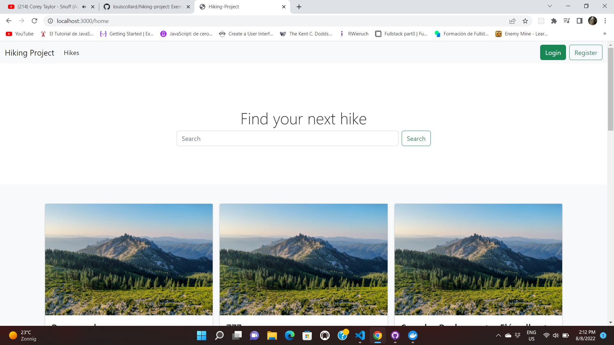
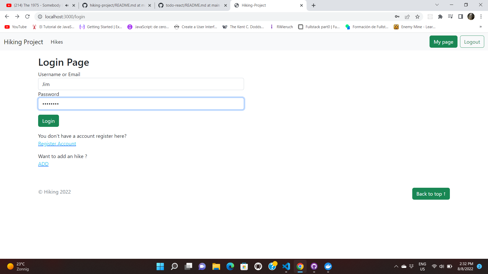

### Hiking Project

This project had as objective apply our knowledge in regard to back end development. We used an MVC architecture to implement the currently way to code a PHP web page.

We think that save your last hike is really important to track down your hiking skills. take a moment and enjoy to save all your hikes.

Keep in mind that it will be required to create an account so we can take care of your hikes. You'll receive a profile where you can:

- Post a hike
- Edit a Hike
- Delete a Hike
- Update a Hike

However, you are going to find differents hikes from different people so you can check what they share to the page.

In colaboration with:

- [Palacios97] (https://github.com/Palacios97)
- [Sebatien voos](https://github.com/VOOSsebastien)
